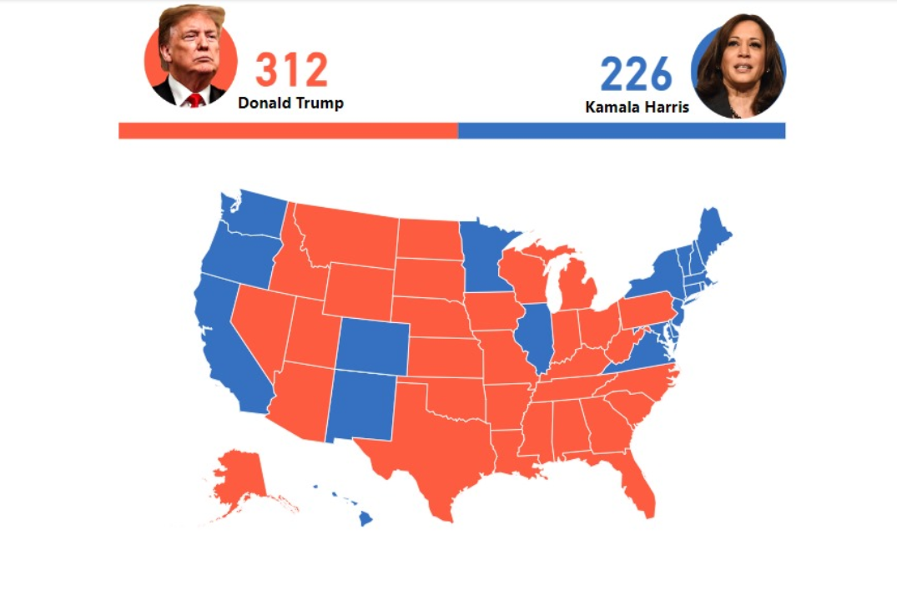

<!--Section 1: Introduce your self-->
## ABOUT ME

Hi there ! I'm Sylvia Antai Experienced Data Analyst specializing in extracting actionable insights from complex datasets. Proficient in statistical analysis, data visualization, and predictive modeling to drive informed business decisions and optimize performance.

<!--Mention your top/relevant skills here - core and soft skills-->
## SKILLS

**- ✅ Data Wrangling and Analytics Consulting.**
I provide in-depth analysis and tailored solutions to help you make data-driven decisions, optimize processes, and drive business growth. 

**- ✅ Data Transformation and Data Visualization.**
I execute and turn datas into usable datasets,make visual representations of data to help people better understand and analyze complex information,process and make data-driven decision-making. 

<!--Section 2: List 3-4 key projects-->
## MY PROJECTS 

*A glimpse of some of the projects I've been working on.*

** An Analysis report on how DONALD TRUMP Won The 2024 US Presidential Election.**

The sinking of the Titanic is one of the most infamous shipwrecks in history.

[Read More](https://www.linkedin.com/pulse/predictive-modeling-hypothesis-testing-using-titanic-dataset-anietie/)

**Asset Management Analysis.**

On April 15, 1912, during her maiden voyage, the widely considered “unsinkable” RMS Titanic sank after colliding with an iceberg. 

[Read More](https://www.linkedin.com/pulse/predictive-modeling-hypothesis-testing-using-titanic-dataset-anietie/)

**Procurement Analysis.**

Unfortunately, there weren’t enough lifeboats for everyone onboard, resulting in the death of 1502 out of 2224 passengers and crew. 

[Read More](https://www.linkedin.com/pulse/predictive-modeling-hypothesis-testing-using-titanic-dataset-anietie/)

## MY CLASSES

*Call my admin for details about the classes: 08034730987.*

- Settings | One-on-One, Group, Communities.								       		
- Platforms	| Physical or Virtual, Weekday or Weekend. 			        		
- Courses | Advanced Excel, Statistics, Power BI, SQL, Tableau, Python.

<!--Section 3: This section is optional. You can replace this section with a list of your core skills-->
## MY COURSES
*You can get these courses today.*

**Performance Analysis**

Advanced Data Analytics: Mastering the Craft with Portfolio Project using Excel. Master data analytics by solving real-world sales problems using MS Excel 2021, learn core dashboard design and presentation skills and create your portfolio project. This course is designed for beginners and professional data analyst.

[Get this course](https://selar.co/salesdata)

**Attrition Analysis**

In this course, you will learn how to analyze HR and employee data, including demographics, job roles, performance metrics, and workplace satisfaction, to identify the underlying causes and predictors of employee attrition.

[Get this course](https://selar.co/q688i7)

## CONTACT DETAILS

*Let’s connect and see how we can make a difference together!*
<table>
  <tbody>
    <tr>
      <td>📧</td>
      <td><a href="mailto:antai.sylvia6@gmail.com">antai.sylvia6@gmail.com</a></td>
    </tr>
    <tr>
      <td>📞</td>
      <td>(234) 810-002-1591</td>
    </tr>
    <tr>
      <td>📍</td>
      <td>Lagos, Nigeria</td>
    </tr>
    <tr>
      <td>⬇️</td>
      <td><a href="https://antaisylvia.github.io/portfolio1/docs/Profile.pdf">Download my CV</a></td>
    </tr>
    <tr>
      <td>🌐</td>
      <td><a href="https://linkedin.com/in/etukanietie">The things I do daily on LinkedIn</a></td>
    </tr>
    <tr>
      <td>📺</td>
      <td><a href="https://www.youtube.com/@LearnwithEtuk">Watch my tutorials on YouTube</a></td>
    </tr>
  </tbody>
</table>

   

